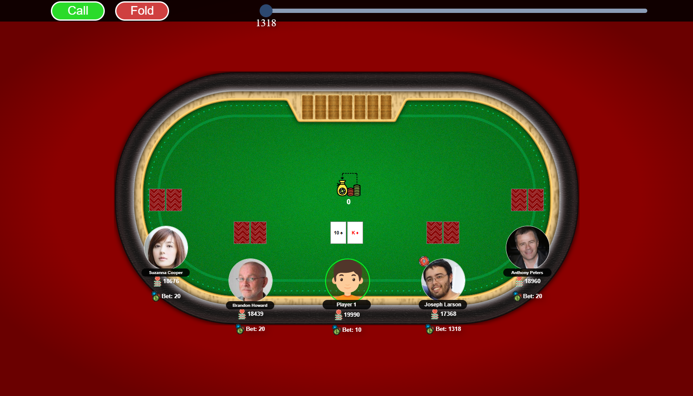

# React Poker Game

A simple and interactive poker game built with React. This project demonstrates modular design, component-based architecture, and seamless gameplay.



## 📖 Table of Contents

- [About the Project](#about-the-project)
- [Getting Started](#getting-started)
  - [Prerequisites](#prerequisites)
  - [Installation](#installation)
- [Usage](#usage)
- [Features](#features)
- [Contributing](#contributing)
- [License](#license)

---

## 🎯 About the Project

React Poker Game is designed to give players a straightforward poker experience while showcasing modern React development practices. It uses libraries like `react-compound-slider` for UI interactivity and `lodash` for efficient data manipulation.

This project is a great starting point for anyone looking to develop a gaming app or dive into React's ecosystem.

---

## 🚀 Getting Started

### Prerequisites

Before you begin, ensure you have the following installed:

- **Node.js** (>= 14.x)
- **Yarn** (or npm)

### Installation

1. Clone the repository:
   ```bash
   git clone https://github.com/superbabii/React-Poker-Game.git
   cd React-Poker-Game
   ```

2. Install dependencies:
   ```bash
   yarn install
   # Or, using npm
   npm install
   ```

3. Start the development server:
   ```bash
   yarn start
   # Or, using npm
   npm start
   ```

---

## 💻 Usage

1. Run the application:
   ```bash
   yarn start
   ```
   The app will launch in your default browser at `http://localhost:3000`.

2. To build the app for production:
   ```bash
   yarn build
   ```

3. To run tests:
   ```bash
   yarn test
   ```

---

## 🌟 Features

- **Interactive UI:** Dynamic components for game elements like sliders and buttons.
- **Reusable Components:** Modularized components for scalability.
- **Performance Optimization:** Use of libraries like `lodash` and `raf` for smooth performance.
- **Custom Styles:** Styled with CSS for an engaging user experience.

---

## 🤝 Contributing

Contributions are welcome! If you'd like to improve the game, follow these steps:

1. Fork the project.
2. Create your feature branch: `git checkout -b feature/YourFeature`.
3. Commit your changes: `git commit -m 'Add some feature'`.
4. Push to the branch: `git push origin feature/YourFeature`.
5. Open a pull request.

---

## 📝 License

This project is licensed under the MIT License. See the [LICENSE](LICENSE) file for details.
